           
--- 

    
# 📚 The Complete RAG End-to-End GenAI Pipeline Course  
 
👨‍🏫 By **Abhi Yadav**  
 
---

## 🌟 Course Philosophy

This course isn’t just a collection of tutorials — it’s a **structured journey**. You’ll start with **foundational knowledge** (what RAG is and why it matters), then move through **practical implementations** across multiple frameworks, and finally master **advanced features** like conversational memory and efficient chaining.

By the end, you’ll have a **portfolio of working RAG apps**, plus the ability to design **custom pipelines for production**.

---

## 🎥 Playlist with Full Details

### **Day 0 – RAG From Scratch (FreeCodeCamp Style Overview)**

* What is RAG and why do we need it?
* Problems with LLMs: hallucinations, lack of domain knowledge.
* Retrieval-Augmented Generation: bridging LLM + external data.
* Simple RAG workflow explained visually.
* Quick “Hello RAG” demo (query → retrieve doc → inject into prompt).

---

### **Day 1 – RAG Pipeline Fundamentals**

* What is a pipeline? Breaking RAG into stages:

  1. Document ingestion
  2. Chunking + embeddings
  3. Vector storage
  4. Query + retrieval
  5. Context injection into LLM
* Building a **minimal pipeline from scratch** with Python.
* Tools: Hugging Face Embeddings + FAISS (basic).

---

### **Day 2 – RAG Pipeline with LLaMA from Scratch**

* Installing and running a **LLaMA-based model locally**.
* Ingesting your dataset (txt/PDF).
* Creating embeddings with SentenceTransformers.
* Retrieval with FAISS + generating answers with LLaMA.
* **Hands-on mini project**: Q\&A over a textbook PDF.

---

### **Day 3 – RAG App with LangChain + OpenAI + FAISS**

* Introduction to **LangChain RAG chains**.
* DocumentLoaders (PDFLoader, TextLoader).
* VectorStore with FAISS.
* RetrievalQA chain with OpenAI GPT-4o.
* **Web App with Streamlit**: “Ask Questions from Your Docs”.

---

### **Day 4 – RAG App with LangChain + Mistral + Weaviate**

* Intro to **Weaviate Vector DB**.
* Mistral AI integration with LangChain.
* Deploying Weaviate locally/cloud.
* Hybrid search: dense + keyword search.
* **Project**: Knowledge Base Q\&A with Mistral + Weaviate.

---

### **Day 5 – RAG with LlamaIndex + MistralAI**

* What is **LlamaIndex** (Indexing framework for RAG).
* How it differs from LangChain.
* Creating index structures: VectorStoreIndex, SummaryIndex.
* Using Mistral for retrieval-based QA.
* **Mini Project**: Company policy document search.

---

### **Day 6 – QA with Docs using LlamaIndex + Gemini**

* Integrating **Gemini (Google’s LLM)** with LlamaIndex.
* Handling multiple document types: PDF, CSV, Notion, APIs.
* QA system: Multi-doc query with structured output.
* **Project**: Build a “Research Paper Assistant” powered by Gemini.

---

### **Day 7 – RAG with Haystack + OpenAI**

* Intro to **Haystack framework**.
* Pipelines in Haystack (retriever + reader).
* Embedding models with Hugging Face + OpenAI.
* **Project**: Legal Document Assistant using Haystack.

---

### **Day 8 – Haystack + MistralAI + Pinecone**

* Vector database **Pinecone** explained.
* Storing embeddings + hybrid search.
* Integrating Pinecone with Haystack.
* **Project**: AI-powered Customer Support Bot.

---

### **Day 9 – RAG with MongoDB Atlas Vector Search + Gemma**

* MongoDB Atlas vector search explained.
* Using **Gemma LLM** for generation.
* Indexing + querying with Atlas Search.
* **Project**: Document QA with MongoDB + Gemma.

---

### **Day 10 – MongoDB + Pinecone RAG (Movie Dataset Demo)**

* Combining multiple vector DBs.
* Movie dataset retrieval.
* Conversational RAG pipeline.
* **Project**: Movie Recommendation + Q\&A Assistant.

---

### **Day 11 – Multi-Document RAG with AstraDB + LangChain**

* What is **AstraDB** (Cassandra + Vector).
* Uploading + querying multiple docs.
* LangChain + Astra integration.
* **Project**: Knowledge Assistant with multiple knowledge bases.

---

### **Day 12 – End-to-End RAG with Llama2.1 + LangChain + FAISS**

* Full **enterprise-ready pipeline**.
* Dataset ingestion → embeddings → FAISS storage → retrieval → answer.
* LangChain advanced retrievers.
* **Project**: HR Assistant with Llama2.1.

---

### **Day 13 – Conversational RAG with Memory + Chat History**

* Why memory matters in RAG (conversations).
* ConversationBufferMemory in LangChain.
* Integrating memory with RAG retrievers.
* **Project**: Conversational Research Assistant.

---

### **Day 14 – Chatbot with LangChain + Memory**

* Building a full chatbot with memory.
* Streamlit UI integration.
* Deploying chatbot to Hugging Face Spaces.
* **Project**: Personal Tutor Chatbot.

---

### **Day 15 – LangChain Expression Language (LCEL) Advanced Chaining**

* LCEL concepts: declarative chaining.
* Custom pipeline construction.
* Composability in RAG pipelines.
* **Project**: Advanced Query Routing Bot.

---

### **Day 16 – LangChain Conversation Buffer Memory**

* Deep dive into **buffer memory**.
* Storing all previous messages.
* When to use vs when to avoid.
* **Demo**: Memory-enhanced Q\&A bot.

---

### **Day 17 – LangChain Entity Memory**

* What is entity memory?
* Storing facts about people, places, orgs.
* **Project**: Conversational bot that remembers user profiles.

---

### **Day 18 – LangChain Summary Memory**

* Problem: Long histories slow down LLMs.
* Solution: Summarized memory.
* Implementing summary memory in LangChain.
* **Project**: Summarized conversational AI assistant.

---

## 🧭 Outcomes

After completing this course, students will:

* Understand **core RAG theory + implementations**.
* Build **15+ working RAG apps** across multiple frameworks.
* Be fluent with **LangChain, LlamaIndex, Haystack**.
* Work with **vector DBs** (FAISS, Weaviate, Pinecone, MongoDB, AstraDB).
* Implement **conversational memory** in GenAI apps.
* Deploy **real-world RAG pipelines** for business use cases.

* # 🌳 The Complete RAG End-to-End GenAI Pipeline Course — LangGraph & Tree Workflow

---

## 📌 Tree Workflow (ASCII Form)

```
RAG Course
│
├── Day 0: RAG from Scratch (Overview)
│
├── Day 1–2: Core RAG Pipeline
│   ├── Day 1: Fundamentals + Stages
│   └── Day 2: LLaMA RAG from Scratch
│
├── Day 3–6: LangChain & LlamaIndex
│   ├── Day 3: LangChain + OpenAI + FAISS
│   ├── Day 4: LangChain + Mistral + Weaviate
│   ├── Day 5: LlamaIndex + MistralAI
│   └── Day 6: LlamaIndex + Gemini
│
├── Day 7–8: Haystack RAG
│   ├── Day 7: Haystack + OpenAI
│   └── Day 8: Haystack + MistralAI + Pinecone
│
├── Day 9–11: Vector Databases
│   ├── Day 9: MongoDB + Gemma
│   ├── Day 10: MongoDB + Pinecone (Movie Data)
│   └── Day 11: AstraDB + LangChain
│
├── Day 12: End-to-End RAG (Llama2.1 + LangChain + FAISS)
│
├── Day 13–14: Conversational RAG
│   ├── Day 13: RAG + Memory + Chat History
│   └── Day 14: Chatbot with Memory
│
├── Day 15: LangChain Expression Language (LCEL)
│
├── Day 16–18: Memory Classes
│   ├── Day 16: Buffer Memory
│   ├── Day 17: Entity Memory
│   └── Day 18: Summary Memory
```

---

## 📌 Mermaid Tree (for GitHub Rendering)

```mermaid
graph TD;
    A[RAG Course] --> B0[Day 0: Intro RAG]
    A --> B1[Core Pipeline]
    B1 --> B1a[Day 1: Fundamentals]
    B1 --> B1b[Day 2: LLaMA Pipeline]

    A --> B2[LangChain & LlamaIndex]
    B2 --> B2a[Day 3: LC + OpenAI + FAISS]
    B2 --> B2b[Day 4: LC + Mistral + Weaviate]
    B2 --> B2c[Day 5: LlamaIndex + Mistral]
    B2 --> B2d[Day 6: LlamaIndex + Gemini]

    A --> B3[Haystack]
    B3 --> B3a[Day 7: Haystack + OpenAI]
    B3 --> B3b[Day 8: Haystack + Pinecone + Mistral]

    A --> B4[Vector DBs]
    B4 --> B4a[Day 9: MongoDB + Gemma]
    B4 --> B4b[Day 10: Mongo + Pinecone]
    B4 --> B4c[Day 11: AstraDB + LangChain]

    A --> B5[Day 12: End-to-End RAG Llama2.1]

    A --> B6[Conversational RAG]
    B6 --> B6a[Day 13: RAG + Memory]
    B6 --> B6b[Day 14: Chatbot with Memory]

    A --> B7[Day 15: LCEL Advanced]

    A --> B8[Memory Classes]
    B8 --> B8a[Day 16: Buffer Memory]
    B8 --> B8b[Day 17: Entity Memory]
    B8 --> B8c[Day 18: Summary Memory]
```



---

## 📌 LangGraph Workflow (Python Example)

```python
from langgraph.graph import StateGraph, END

# Define state
class RAGState:
    day: int
    topic: str

# Initialize Graph
graph = StateGraph(RAGState)

# Nodes (Course Days)
def day0(state):
    return {"day": 0, "topic": "RAG Intro"}

def day1(state):
    return {"day": 1, "topic": "Pipeline Fundamentals"}

# Add more nodes up to Day 18...

graph.add_node("Day0", day0)
graph.add_node("Day1", day1)
# ... add Day2 → Day18

# Flow
graph.set_entry_point("Day0")
graph.add_edge("Day0", "Day1")
graph.add_edge("Day1", "Day2")
# continue chaining until Day18 → END

# Compile
graph.set_finish_point("Day18")
app = graph.compile()

# Example run
print(app.invoke({}))
```

---

## 👨‍🏫 About the Instructor

**Abhishek Kumar (Abhi)**
💡 AI Engineer | Data Scientist | Educator | Builder of AI Agents

* Known for making **complex AI concepts simple**
* Passionate about **teaching students with practical examples**
* Focus on **research + industry application**

---

🔥 *This repository + video series is your one-stop place for mastering **LLM RAG Pineline Mastery***.

---

## 👨‍💻 Developer Information  

**Created by Abhi Yadav**  
📧 **Email:** abhiydv23096@gmail.com  
🔗 **LinkedIn:** [Abhi Yadav](https://www.linkedin.com/in/your-linkedin-profile)  
🐙 **GitHub Profile:** [@abhishekkumar62000](https://github.com/abhishekkumar62000)  

📸 **Developer Profile Image:**  

<p align="center">
  

      
</p>


